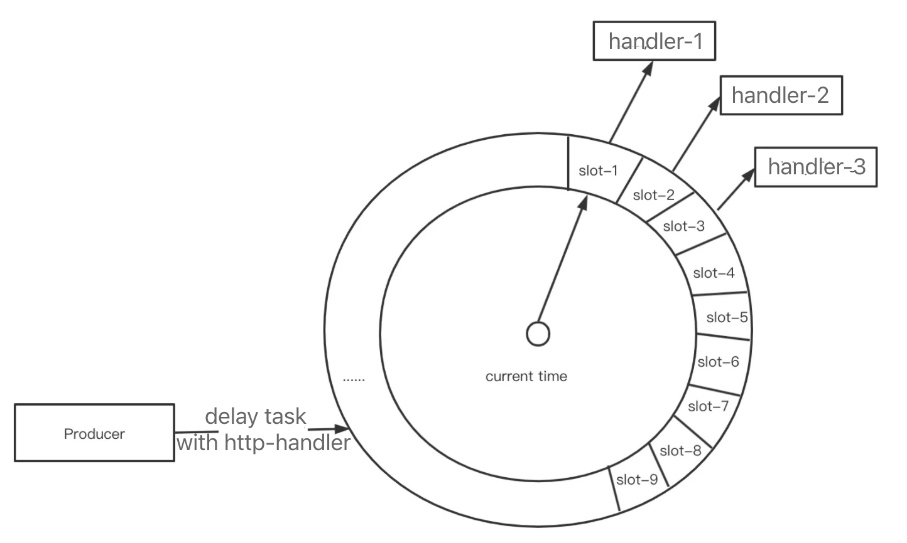

# delay-tasks

a delayed tasks implementation.



## Usage

```bash
$ git clone https://github.com/rosbit/delay-tasks
$ cd delay-tasks
$ make
```

  An executable will be generated. Run it like this

```bash
$ CONF_FILE=./sample.conf.json ./delay-tasks
```

## API

### 1. Register category handler

- POST /handler/:cate

- Body:
  
  ```json
  {"handler": "a http url"}
  ```

- Response
  
  ```json
  {
     "code": 200,
     "msg": "OK"
  }
  ```

- An handler must be implemented as
  
  - method: POST
  - BODY: a JSON of delayed task `params`, see params detail in Create/Update task.

### 2. Create/Update a delayed task in a category

- POST /task/:cate

- Body:
  
  ```json
  {
    "timestamp": in-seconds,
    "key": uint64,
    "params": {anything},
    "handler": "using caterory handler if it is blank"
  }
  ```

- Response
  
  ```json
  {
     "code": 200,
     "msg": "OK"
  }
  ```

### 3. Remove a delayted task in a category

- DELETE /task/:cate

- Body:
  
  ```json
  {
     "timestamp": in-seconds,
     "key": uint64, 
     "exec": true|false // executing task before being removed if true.
  }
  ```

- Response
  
  ```json
  {
     "code": 200,
     "msg": "OK"
  }
  ```

### 4. Get task

- GET /task/:cate/:key[?timestamp=xxx]

- Response
  
  ```json
  {
     "code": 200,
     "msg": "OK",
     "result": {
        "timeToRun": xxxx,
        "params": {JSON},
        "handler": "http://handler"
     }
  }
  ```

### 5. List tasks

- GET /tasks
- Result will be dumped as Response.
